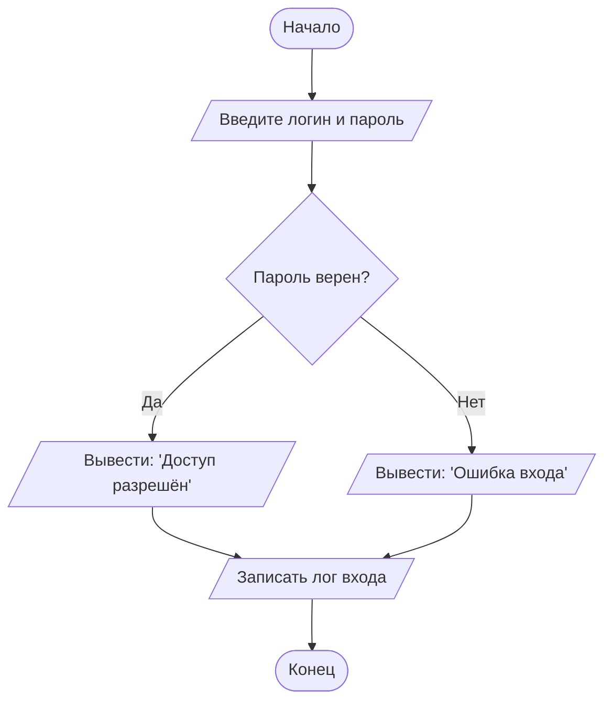

В рамках задания была создана и размещена на GitHub сложная блок-схема алгоритма. Схема включает в себя условные операторы (if/else) для ветвления логики и операторы вывода (print) для отображения результатов.

