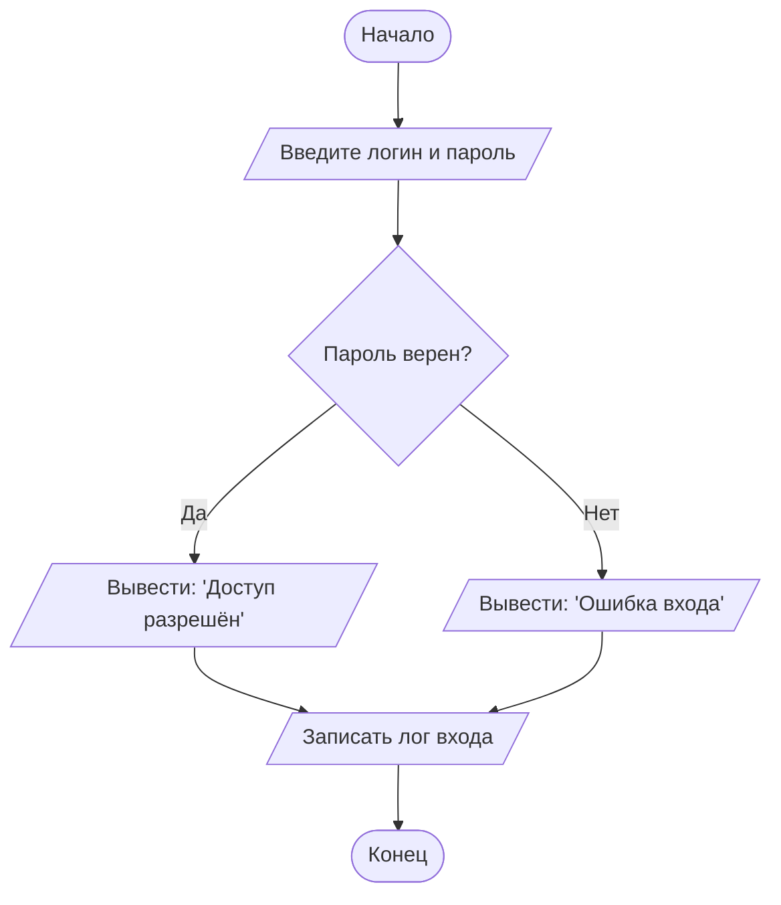

```mermaid
graph TD
    Start([Начало]) --> Input[/"Введите логин и пароль"/];
    Input --> Check{Пароль верен?};
    Check -- Да --> PrintSuccess[/"Вывести: 'Доступ разрешён'"/];
    Check -- Нет --> PrintError[/"Вывести: 'Ошибка входа'"/];
    PrintSuccess --> Log[/"Записать лог входа"/];
    PrintError --> Log;
    Log --> Finish([Конец]);
```
